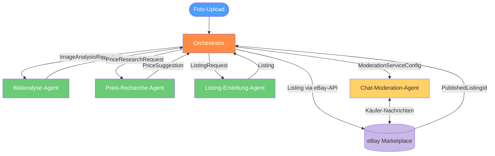

# eBay-Auto-Lister — Systemarchitektur

## 1. Überblick & Ziele

Der **eBay-Auto-Lister** ist ein Python-basiertes Multi-Agent-System, das den vollständigen Prozess vom Produktfoto bis zur veröffentlichten eBay-Anzeige automatisiert. Durch den Einsatz spezialisierter KI-Agenten in einer koordinierten Pipeline wird jeder Schritt von der Bildanalyse über die Preisrecherche und Listing-Erstellung bis hin zur Chat-Moderation abgedeckt.

### Kernziele

- **Vollautomatisierung:** Minimaler manueller Aufwand nach dem Upload eines Fotos
- **Qualitätssicherung:** Jeder Agent liefert strukturierte, validierbare Outputs
- **Skalierbarkeit:** Agenten können unabhängig erweitert oder ersetzt werden
- **Compliance:** Einhaltung der eBay-API-Richtlinien und -Nutzungsbedingungen

---

## 2. BMAD-Orchestrierungsmodell

### Warum Orchestrierung statt monolithisch?

Ein monolithischer Ansatz würde alle Aufgaben (Vision, Preisanalyse, Texterstellung, Moderation) in einem einzigen Prozess vermischen. Das erzeugt:

- Enge Kopplung: Änderungen an einem Schritt gefährden alle anderen
- Keine Wiederverwendbarkeit: Einzelschritte können nicht isoliert getestet oder ausgetauscht werden
- Schwache Fehlerbehandlung: Ein Fehler stoppt die gesamte Pipeline

Das BMAD-Prinzip (Business Method Agent Design) löst dies durch klare **Rollenverteilung**, **definierte Schnittstellen (Contracts)** und einen zentralen **Orchestrator**, der den Zustand hält und die Hand-offs steuert.

### Rolle des Orchestrators

Der Orchestrator ist der einzige Teilnehmer, der den vollständigen **Session-State** kennt. Er:

1. Nimmt den initialen Job-Request entgegen (Foto-Pfad, Nutzerkonfiguration)
2. Übergibt Tasks sequenziell an die Fach-Agenten
3. Validiert den Output jedes Agenten gegen dessen Contract
4. Schreibt Zwischenergebnisse in das gemeinsame `ItemState`-Objekt
5. Behandelt Fehler und entscheidet über Retry oder Abbruch
6. Startet nach Veröffentlichung den Chat-Moderation-Agenten als parallelen Service

### Hand-offs zwischen Agenten

Jeder Hand-off ist ein expliziter Methodenaufruf mit typisiertem Input und Output:

```
Orchestrator → Bildanalyse-Agent     : ImageAnalysisRequest  → ItemData
Orchestrator → Preis-Recherche-Agent : PriceResearchRequest  → PriceSuggestion
Orchestrator → Listing-Erstellung    : ListingRequest        → Listing
Orchestrator → eBay-API              : Listing               → PublishedListingId
Orchestrator → Chat-Moderation-Agent : ModerationServiceConfig (Fire-and-Forget)
```

### Nachrichten & State

- **ItemState:** Zentrales Zustandsobjekt, das der Orchestrator durch die gesamte Pipeline mitführt
- **Messages:** Jeder Agenten-Aufruf ist eine strukturierte Nachricht (Dataclass); kein Shared-Memory zwischen Agenten
- **Zustandspersistenz:** Nach jedem erfolgreichen Schritt wird der State in eine JSON-Datei geschrieben (Resume-Fähigkeit bei Absturz)

---

## 3. Pipeline-Diagramm



---

## 4. Agent-Steckbriefe

### Orchestrator

| Eigenschaft | Beschreibung |
|---|---|
| **Rolle** | Zentraler Koordinator der gesamten Pipeline |
| **Verantwortung** | Job-Verwaltung, State-Management, Fehlerbehandlung, Hand-offs |
| **Inputs** | Job-Request (Foto-Pfad, Nutzerkonfiguration) |
| **Outputs** | Finaler `ItemState` mit `published_listing_id` |
| **Tools/Modelle** | Kein KI-Modell; reine Python-Orchestrierungslogik |
| **Fehlerfälle** | Agent-Timeout → Retry (max. 3x); Contract-Verletzung → Abbruch mit Fehlermeldung; API-Fehler → Exponential Backoff |

---

### Bildanalyse-Agent

| Eigenschaft | Beschreibung |
|---|---|
| **Rolle** | Extrahiert strukturierte Produktdaten aus Fotos |
| **Verantwortung** | Objekterkennung, Zustandsbewertung, Kategorie-Klassifikation, Merkmalextraktion |
| **Inputs** | `ImageAnalysisRequest(image_path: str, language: str)` |
| **Outputs / Contract** | `ItemData(title: str, category: str, condition: str, features: list[str], brand: str \| None, confidence: float)` |
| **Tools/Modelle** | Vision-LLM (z. B. `claude-sonnet-4-6` mit Vision); optional lokales CLIP-Modell für Vorklassifikation |
| **Fehlerfälle** | Bild unlesbar → `ImageAnalysisError`; `confidence < 0.6` → Orchestrator fragt Nutzer zur Verifikation; Kein Objekt erkannt → Abbruch |

---

### Preis-Recherche-Agent

| Eigenschaft | Beschreibung |
|---|---|
| **Rolle** | Ermittelt marktgerechte Preisempfehlung |
| **Verantwortung** | Scraping abgeschlossener eBay-Verkäufe, Preisstatistik, Wettbewerbsanalyse |
| **Inputs** | `PriceResearchRequest(item: ItemData, max_results: int = 20)` |
| **Outputs / Contract** | `PriceSuggestion(suggested_price: Decimal, price_range: tuple[Decimal, Decimal], avg_sold_price: Decimal, sample_size: int, confidence: float)` |
| **Tools/Modelle** | eBay Finding API (abgeschlossene Listings); Scraper-Fallback für erweiterte Daten; statistisches Modul (`src/scrapers/price_analyzer.py`) |
| **Fehlerfälle** | Keine Vergleichsdaten → `PriceResearchWarning` + Schätzwert; API-Rate-Limit → Warten + Retry; `sample_size < 3` → Niedrige Konfidenz wird im Output markiert |

---

### Listing-Erstellung-Agent

| Eigenschaft | Beschreibung |
|---|---|
| **Rolle** | Generiert verkaufsfördernde eBay-Anzeigentexte |
| **Verantwortung** | Titel (max. 80 Zeichen), Beschreibungstext, eBay-Kategoriezuordnung, Versandoptionen vorschlagen |
| **Inputs** | `ListingRequest(item: ItemData, price: PriceSuggestion, language: str, seller_config: SellerConfig)` |
| **Outputs / Contract** | `Listing(title: str, description: str, category_id: str, price: Decimal, condition_id: str, shipping_options: list[ShippingOption], images: list[str])` |
| **Tools/Modelle** | Text-LLM (`claude-sonnet-4-6`); eBay-Kategorie-Lookup-Tabelle; Titel-Optimizer mit Keyword-Extraktion |
| **Fehlerfälle** | Titel > 80 Zeichen → automatisches Kürzen + Log; Ungültige Kategorie-ID → Fallback auf Elternkategorie; LLM-Timeout → Retry mit vereinfachtem Prompt |

---

### Chat-Moderation-Agent

| Eigenschaft | Beschreibung |
|---|---|
| **Rolle** | Begleitender Service für Käufer-Kommunikation nach Veröffentlichung |
| **Verantwortung** | Automatische Beantwortung häufiger Fragen, Spam-Filterung, Eskalation komplexer Anfragen |
| **Inputs** | `ModerationServiceConfig(listing_id: str, item: ItemData, auto_reply: bool, escalation_email: str)` |
| **Outputs / Contract** | Feuert Events: `MessageReplied`, `MessageEscalated`, `SpamDetected` |
| **Tools/Modelle** | Text-LLM (`claude-haiku-4-5-20251001` für niedrige Latenz); eBay Messaging API; Spam-Klassifikator |
| **Fehlerfälle** | Unbekannte Frage + `auto_reply=True` → Standardantwort + Eskalation; API-Fehler → Silent Retry; Modell-Timeout → Direkte Weiterleitung an Verkäufer |

---

## 5. Datenmodelle

```python
from dataclasses import dataclass, field
from decimal import Decimal


@dataclass
class ItemData:
    title: str
    category: str
    condition: str                   # "new", "used_good", "used_fair", "defective"
    features: list[str] = field(default_factory=list)
    brand: str | None = None
    confidence: float = 0.0


@dataclass
class PriceSuggestion:
    suggested_price: Decimal
    price_range: tuple[Decimal, Decimal]
    avg_sold_price: Decimal
    sample_size: int
    confidence: float


@dataclass
class ShippingOption:
    service: str
    cost: Decimal
    estimated_days: int


@dataclass
class Listing:
    title: str                       # max. 80 Zeichen
    description: str
    category_id: str
    price: Decimal
    condition_id: str
    shipping_options: list[ShippingOption]
    images: list[str]                # lokale Dateipfade oder URLs
    published_listing_id: str | None = None


@dataclass
class Message:
    listing_id: str
    sender_id: str
    content: str
    timestamp: str                   # ISO 8601
    reply: str | None = None
    escalated: bool = False


@dataclass
class ItemState:
    job_id: str
    image_path: str
    item_data: ItemData | None = None
    price_suggestion: PriceSuggestion | None = None
    listing: Listing | None = None
    published_listing_id: str | None = None
    status: str = "pending"          # pending, analyzing, pricing, listing, publishing, live, error
    error: str | None = None
```

---

## 6. Tech-Stack & Modulstruktur

### Tech-Stack

| Komponente | Technologie |
|---|---|
| Sprache | Python 3.12+ |
| KI-Modelle | Anthropic Claude API (`claude-sonnet-4-6`, `claude-haiku-4-5-20251001`) |
| eBay-Integration | eBay Trading API, eBay Finding API, eBay Messaging API |
| HTTP-Client | `httpx` (async) |
| Validierung | `pydantic` v2 |
| Secrets | SOPS + age |
| Tests | `pytest` + `pytest-asyncio` |
| Linting | `ruff` |

### Modulstruktur

```
src/
├── agents/
│   ├── orchestrator.py          # Pipeline-Koordination, State-Management
│   ├── image_analysis.py        # Bildanalyse-Agent
│   ├── price_research.py        # Preis-Recherche-Agent
│   ├── listing_creation.py      # Listing-Erstellung-Agent
│   └── chat_moderation.py       # Chat-Moderation-Agent (Service)
├── scrapers/
│   ├── ebay_sold_listings.py    # Scraper für abgeschlossene Verkäufe
│   └── price_analyzer.py        # Statistische Preisauswertung
├── api/
│   ├── ebay_trading.py          # eBay Trading API Client
│   ├── ebay_finding.py          # eBay Finding API Client
│   └── ebay_messaging.py        # eBay Messaging API Client
├── models.py                    # Alle Dataclasses / Pydantic-Modelle
└── config.py                    # Konfiguration aus Umgebungsvariablen

tests/
├── agents/
├── scrapers/
└── api/

docs/
└── architecture.md
```

---

## 7. Sicherheit & Compliance

### eBay-API & Nutzungsbedingungen

- **Rate Limits:** Alle API-Aufrufe laufen durch ein zentrales Rate-Limit-Modul mit Exponential Backoff
- **ToS-Compliance:** Automatisch generierte Texte werden auf verbotene Inhalte geprüft (Keyword-Blacklist + LLM-Validierung)
- **Kein Scraping produktiver Listings:** Preisrecherche ausschließlich über die offizielle Finding API oder explizit erlaubte Endpunkte
- **API-Credentials:** Niemals im Code hardcodiert — ausschließlich über Umgebungsvariablen

### Secrets-Management (SOPS + age)

Dieses Projekt folgt dem globalen Secrets-Standard des openclaw-Servers:

- **Verschlüsselung:** Alle `.env`-Dateien werden mit SOPS + age verschlüsselt
- **age Public Key:** `age1vf04awvs2t0agylyz6yz2yrkngks3592d6s8agw3uu8hs8qks32qzpaldg`
- **Management:** `/opt/secrets/secrets.sh encrypt ebay-auto-lister` nach jeder Änderung
- **Berechtigungen:** `.env`-Dateien müssen `chmod 600` haben

### .env-Regeln

```
# .env (NIEMALS committen)
EBAY_APP_ID=...
EBAY_CERT_ID=...
EBAY_DEV_ID=...
EBAY_AUTH_TOKEN=...
ANTHROPIC_API_KEY=...
```

- `.env` ist in `.gitignore` eingetragen — ein Commit schlägt fehl, wenn `.env` staged wird
- CI/CD erhält Secrets ausschließlich über verschlüsselte Umgebungsvariablen, nicht über Repository-Dateien
- Rotation von API-Keys erfolgt über `secrets.sh edit ebay-auto-lister` → Änderung → `secrets.sh encrypt ebay-auto-lister`
